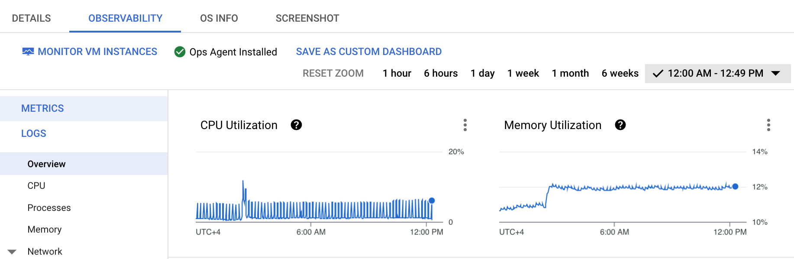

# jitsi-gcp
Scripts and stuff to run a Jitsi installation in Google Cloud

[Jitsi](https://github.com/jitsi/) is Zoom/Google Meet-like videoconferencing.
It has a web client that can run in browser, and a mobile app (through React
Native). The backend consists of several server systems, which are running
free for public use at https://meet.jit.si, as-a-service commercially, or can
be run independently.

This repo contains scripts I used to run my own Jitsi Meet installation on
Google Cloud Platform.

Clients send media to a Jitsi server through WebRTC, which needs HTTPS.
Self-signed SSL certificates work with web clients, but not with mobile. So
it's better to have a domain name and real SSL certificates for it. 

To roll your own Jitsi on Google Cloud, these steps need to be taken before
running the scripts, explained below:

1. DNS Config and service account permissions
2. Upload SSL certificates into [Secret Manager](https://console.cloud.google.com/security/secret-manager), note their names
3. Configure firewall rules to let Jitsi connections in
4. Create and run the instance

## 1. DNS Config and service account permissions

The first thing is to register a domain and create a zone in [Google Cloud
DNS](https://console.cloud.google.com/net-services/dns/zones) to manage the
domain names. For experimentation, VMs may often be created and deleted.
Also, to save costs, you can use spot instances that can be stopped at any
time. So [gcp_renew-dns.py](./gcp_renew-dns.py) is a script that, when run
from inside a VM instance, will renew a given DNS name to point to that
instance's current IP address. It is cheaper than purchasing a static public
IP address. 

To be able to do that, the VM service account needs to have a DNS Administrator role. 

If you have `jq` installed where you run gcloud (GCP Cloud shell does), to
create a service account the service account `jitsi-service-account` with
necessary role grants, _select a project_ (`gcloud config set project
[PROJECT_ID]`) and run 

```bash
export GCP_PROJECT=$(gcloud config get project)
export SERVICE_ACC=$(gcloud iam service-accounts create jitsi-service-account \
    --display-name="Jitsi Service Account" \
    --format=json | jq -r ".email")
gcloud projects add-iam-policy-binding $GCP_PROJECT\
    --member=serviceAccount:${SERVICE_ACC} --role=roles/dns.admin #1
gcloud projects add-iam-policy-binding $GCP_PROJECT\
    --member=serviceAccount:${SERVICE_ACC} --role=roles/monitoring.metricWriter #2
gcloud projects add-iam-policy-binding $GCP_PROJECT\
    --member=serviceAccount:${SERVICE_ACC} --role=roles/secretmanager.secretAccessor #3
```

These are permissions to 1) change DNS records, 2) to report performance
metrics through Google Cloud Ops agent for dashboards etc, and 3) to access
SSL certificates through secrets.


## 2. Upload SSL certificates to GCP's Secret Manager

The two files we need are the server private key and the full certification
chain file. In a Let's Encrypt-supplied certificate archive (as of November
2022) they are called `<HOSTNAME>/key.pem` and `<HOSTNAME>/fullchain.pem`.
Upload them to the [Secret Manager](https://console.cloud.google.com/security/secret-manager) and 
record their names, you will need them.


## 3. Configure firewall rules

We will use the tags `jitsi` for our instances. The gcloud command to create
firewall rule to allow connections on necessary ports for instances tagged 
in this way is:

```bash
gcloud compute firewall-rules create allow-jitsi \
       --allow=tcp:80,tcp:443,tcp:4443,tcp:5349,udp:10000,udp:3478 \
       --target-tags=jitsi
```

Make sure you have no higher-priority rules blocking the same ports.

There are at least two easy options for installing Jitsi: from Docker
containers or from Debian/Ubuntu packages.


## 4A. Create and run the instance (Dockerized setup)

The Jitsi project provides docker containers for its backend projects meant to
be run together using `docker-compose`. The upside is that it packages all
the dependencies neatly. The downside is the small extra level of indirection.

at the configuration files
reside inside the containers, usually in `/config`, and you have to go inside
the container to modify them. A few most important ones are passed as
environment variables by `docker-compose` from the file `.env`, so if no
further customizations are wanted, this is not a problem.

To create the instance with containerized Jitsi setup, change the vars at the
start of command as desired, pay special attention to the names of the
secrets for SSL stuff created at Step 2. And run this `gcloud` command 
_after selecting the default project_.

```bash
# Change these vars if needed 
REGIONZONE=europe-west3-c
GCP_PROJECT=$(gcloud config get project)
MACHINETYPE=e2-standard-2
DNSZONE=example-zone
HOSTNAME=jitsi
DOMAIN=example.com
INSTANCE_NAME=jitsi-demo-instance
FULLCHAINSECRET=jitsi-example-com-fullchain-pem
KEYSECRET=jitsi-example-com-key-pem
SERVICE_ACC=jitsi-service-account@${GCP_PROJECT}.iam.gserviceaccount.com
SPOT=1 # remove this line if spot instance is not desired

gcloud compute instances create $INSTANCE_NAME --project=$GCP_PROJECT \
     --zone=$REGIONZONE --machine-type=$MACHINETYPE \
     --network-interface=network-tier=PREMIUM,subnet=default \
     --metadata=domain=$DOMAIN,fullchainsecret=$FULLCHAINSECRET,hostname=$HOSTNAME,keysecret=$KEYSECRET,zone=$DNSZONE,startup-script=\#\!/bin/bash$'\n'sudo\ apt-get\ update$'\n'sudo\ apt-get\ install\ -y\ git$'\n'git\ clone\ https://github.com/saaska/jitsi-gcp\ /tmp/jitsi-gcp$'\n'cd\ /tmp/jitsi-gcp$'\n'bash\ ./setup-jitsi-instance.sh \
     --no-restart-on-failure --maintenance-policy=TERMINATE $([ "$SPOT" = "1" ] && echo --preemptible || echo "") \
     --provisioning-model=$([ "$SPOT" = "1" ] && echo SPOT || echo STANDARD) --instance-termination-action=STOP \
     --service-account=$SERVICE_ACC \
     --scopes=https://www.googleapis.com/auth/cloud-platform \
     --tags=jitsi,http-server,https-server \
     --create-disk=auto-delete=yes,boot=yes,device-name=demo-instance,image-project=debian-cloud,image-family=debian-11,mode=rw,size=10,type=projects/jitsi-demos/zones/$REGIONZONE/diskTypes/pd-balanced \
     --no-shielded-secure-boot --shielded-vtpm --shielded-integrity-monitoring \
     --reservation-affinity=any
```

This will create an instance with a service account having necessary
permissions, a network tag to open necessary ports, and clone this repo.
From there the `setup-jitsi-instance.sh` script will update the host DNS
record, retrive SSL certs, install Docker, download, setup and run the Jitsi
containers.

Everyting downloaded and installed by the script will be root-owned.

The logs of the setup process will be in the file `/var/log/setup-jitsi.log`.


# 5. Ops Agent

If you want performance monitoring, for example, nice graphs right on the instance
page, Google Cloud Ops Agent needs to be installed on the VM. 
Execute this right after Step 4 in the same shell:

```bash
:> agents_to_install.csv && echo '"projects/$GCP_PROJECT/zones/$REGIONZONE/instances/$INSTANCE_NAME","[{""type"":""ops-agent""}]"' >> agents_to_install.csv && curl -sSO https://dl.google.com/cloudagents/mass-provision-google-cloud-ops-agents.py && python3 mass-provision-google-cloud-ops-agents.py --file agents_to_install.csv
```



# Enjoy


